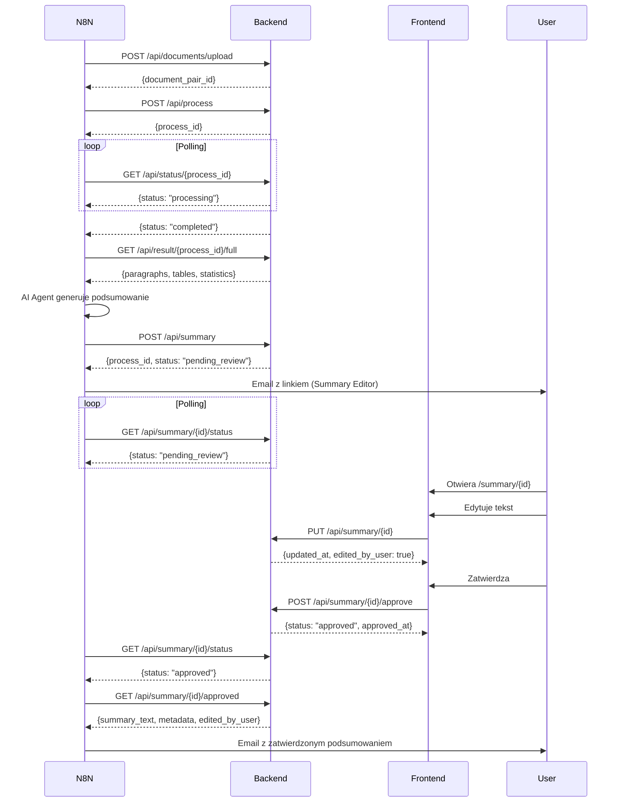

# 📚 Kompletna Dokumentacja API - BAW Document Comparison

**Wersja:** 1.2.0 (VERIFIED)
**Data weryfikacji:** 2025-10-28
**Status:** ✅ Zgodna ze stanem faktycznym kodu

---

## 📖 Spis Treści

1. [Architektura Systemu](#architektura-systemu)
2. [Backend API (UslugaDoPorownan)](#backend-api---uslugadoporownan)
3. [Frontend API (SecureDocCompare)](#frontend-api---securedoccompare)
4. [System Podsumowań (n8n Integration)](#system-podsumowań-n8n-integration)
5. [Modele Danych](#modele-danych)
6. [Workflow Integracji](#workflow-integracji)
7. [Przykłady Użycia](#przykłady-użycia)

---

## 🏗️ Architektura Systemu

### Komponenty:

```
┌─────────────────────────────────────────────────────────────┐
│                         N8N Workflow                         │
│  (Automatyzacja, AI Agent, Email, Podsumowania)             │
└────────────┬────────────────────────────────────┬───────────┘
             │                                    │
             ▼                                    ▼
┌────────────────────────┐         ┌────────────────────────┐
│  SecureDocCompare      │         │  UslugaDoPorownan      │
│  Frontend (Port 8000)  │◄───────►│  Backend (Port 8001)   │
│  - Login/Auth          │         │  - Document Processing │
│  - Dashboard UI        │         │  - PDF Conversion      │
│  - Summary Editor      │         │  - Diff Engine         │
│  - API Proxy           │         │  - Summary Storage     │
└────────────────────────┘         └────────────────────────┘
```

### Porty:
- **Backend (UslugaDoPorownan):** `http://217.182.76.146:8001`
- **Frontend (SecureDocCompare):** `http://217.182.76.146:8000`
- **N8N Workflow:** `http://localhost:5678` (localhost only)

### Storage:
- **In-Memory:** Wszystkie dane (documents, processes, results, summaries)
- **Restart = utrata danych** (brak persistence)
- **Uploads:** Pliki DOCX zapisywane w `uploads/` (nie czyszczone automatycznie)
- **Reports:** Raporty HTML w `output/reports/`

---

## 🔧 Backend API - UslugaDoPorownan

**Base URL:** `http://217.182.76.146:8001`
**Port:** 8001
**Framework:** FastAPI + Uvicorn
**CORS:** Enabled (allow_origins=["*"])

### Endpointy:

| Metoda | Endpoint | Opis | Auth |
|--------|----------|------|------|
| GET | `/` | Informacje o serwisie | ❌ |
| GET | `/health` | Health check + statystyki | ❌ |
| POST | `/api/documents/upload` | Upload dokumentów (DOCX/PDF) | ❌ |
| POST | `/api/process` | Rozpocznij porównywanie | ❌ |
| GET | `/api/status/{process_id}` | Status przetwarzania | ❌ |
| GET | `/api/result/{process_id}/full` | Pełny wynik | ❌ |
| GET | `/api/result/{process_id}/modified` | Tylko zmodyfikowane | ❌ |
| GET | `/api/result/{process_id}/added` | Tylko dodane | ❌ |
| GET | `/api/result/{process_id}/deleted` | Tylko usunięte | ❌ |
| GET | `/api/report/{process_id}/generate` | Generuj raport HTML | ❌ |
| POST | `/api/summary` | Utwórz podsumowanie (n8n) | ❌ |
| GET | `/api/summary/{process_id}/status` | Status podsumowania (polling) | ❌ |
| GET | `/api/summary/{process_id}` | Szczegóły podsumowania | ❌ |
| GET | `/api/summary/{process_id}/approved` | Pobierz zatwierdzone | ❌ |
| PUT | `/api/summary/{process_id}` | Aktualizuj podsumowanie | ❌ |
| POST | `/api/summary/{process_id}/approve` | Zatwierdź/odrzuć | ❌ |

**Razem:** 16 endpointów (10 document comparison + 6 summary system)

---

### 1. GET `/` - Informacje o serwisie

**Odpowiedź (200 OK):**
```json
{
  "service": "Usługa Porównywania Dokumentów",
  "version": "1.1.0",
  "status": "running",
  "endpoints": {
    "upload": "POST /api/documents/upload",
    "process": "POST /api/process",
    "status": "GET /api/status/{process_id}",
    "full": "GET /api/result/{process_id}/full",
    "modified": "GET /api/result/{process_id}/modified",
    "added": "GET /api/result/{process_id}/added",
    "deleted": "GET /api/result/{process_id}/deleted",
    "generate_report": "GET /api/report/{process_id}/generate"
  },
  "summary_endpoints": {
    "create": "POST /api/summary",
    "get_status": "GET /api/summary/{process_id}/status",
    "get_detail": "GET /api/summary/{process_id}",
    "get_approved": "GET /api/summary/{process_id}/approved",
    "update": "PUT /api/summary/{process_id}",
    "approve": "POST /api/summary/{process_id}/approve"
  }
}
```

---

### 2. GET `/health` - Health Check

**Odpowiedź (200 OK):**
```json
{
  "status": "healthy",
  "timestamp": "2025-10-28T10:30:45.123456",
  "statistics": {
    "total_documents": 10,
    "total_processes": 8,
    "completed_processes": 7,
    "failed_processes": 1,
    "total_summaries": 5,
    "pending_summaries": 2,
    "approved_summaries": 3
  }
}
```

---

### 3. POST `/api/documents/upload` - Upload Dokumentów

**Content-Type:** `multipart/form-data`

**Parametry:**
- `old_document` (file, **required**) - Stary dokument (.docx lub .pdf)
- `new_document` (file, **required**) - Nowy dokument (.docx lub .pdf)

**Obsługiwane formaty:**
- `.docx` - Bezpośrednio przetwarzany
- `.pdf` - Automatyczna konwersja do DOCX (pdf2docx → pdfplumber fallback)

**curl:**
```bash
curl -X POST http://217.182.76.146:8001/api/documents/upload \
  -F "old_document=@stara_wersja/dokument.docx" \
  -F "new_document=@nowa_wersja/dokument.docx"
```

**Odpowiedź (200 OK):**
```json
{
  "document_pair_id": "a1b2c3d4-e5f6-7890-abcd-ef1234567890",
  "status": "uploaded",
  "message": "Dokumenty zostały załadowane: old.docx, new.docx"
}
```

**Z konwersją PDF:**
```json
{
  "document_pair_id": "a1b2c3d4-e5f6-7890-abcd-ef1234567890",
  "status": "uploaded",
  "message": "Dokumenty zostały załadowane: old.pdf, new.pdf\nStary dokument PDF skonwertowany (metoda: pdf2docx, jakość: 0.92)\nNowy dokument PDF skonwertowany (metoda: pdfplumber, jakość: 0.79)"
}
```

**Błędy:**
- `400 Bad Request` - Nieprawidłowy format pliku
- `500 Internal Server Error` - Błąd konwersji PDF

---

### 4. POST `/api/process` - Rozpocznij Przetwarzanie

**Content-Type:** `application/json`

**Request Body:**
```json
{
  "document_pair_id": "a1b2c3d4-e5f6-7890-abcd-ef1234567890"
}
```

**Model:** `ProcessRequest`
```python
class ProcessRequest(BaseModel):
    document_pair_id: str
```

**curl:**
```bash
curl -X POST http://217.182.76.146:8001/api/process \
  -H "Content-Type: application/json" \
  -d '{"document_pair_id": "a1b2c3d4-e5f6-7890-abcd-ef1234567890"}'
```

**Odpowiedź (200 OK):**
```json
{
  "process_id": "f1e2d3c4-b5a6-7890-cdef-1234567890ab",
  "status": "started",
  "message": "Przetwarzanie zostało rozpoczęte"
}
```

**Przetwarzanie:**
- Asynchroniczne (FastAPI BackgroundTasks)
- Zwraca natychmiast `process_id`
- Sprawdzaj status przez polling `/api/status/{process_id}`

**Błędy:**
- `404 Not Found` - Nie znaleziono pary dokumentów
- `500 Internal Server Error` - Błąd rozpoczynania przetwarzania

---

### 5. GET `/api/status/{process_id}` - Status Przetwarzania

**Parametry URL:**
- `process_id` (UUID, **required**)

**curl:**
```bash
curl http://217.182.76.146:8001/api/status/f1e2d3c4-b5a6-7890-cdef-1234567890ab
```

**Możliwe statusy:**

#### Status: `pending`
```json
{
  "process_id": "f1e2d3c4-b5a6-7890-cdef-1234567890ab",
  "status": "pending",
  "progress": 0,
  "message": "Oczekiwanie na rozpoczęcie przetwarzania",
  "started_at": "2025-10-28T10:30:00.123456",
  "completed_at": null,
  "error": null
}
```

#### Status: `processing`
```json
{
  "process_id": "f1e2d3c4-b5a6-7890-cdef-1234567890ab",
  "status": "processing",
  "progress": 50,
  "message": "Porównywanie dokumentów",
  "started_at": "2025-10-28T10:30:00.123456",
  "completed_at": null,
  "error": null
}
```

**Etapy przetwarzania:**
- 0-10: Oczekiwanie
- 10-30: Ekstrakcja ze starego dokumentu
- 30-50: Ekstrakcja z nowego dokumentu
- 50-80: Porównywanie
- 80-100: Tworzenie wyników

#### Status: `completed`
```json
{
  "process_id": "f1e2d3c4-b5a6-7890-cdef-1234567890ab",
  "status": "completed",
  "progress": 100,
  "message": "Przetwarzanie zakończone pomyślnie",
  "started_at": "2025-10-28T10:30:00.123456",
  "completed_at": "2025-10-28T10:30:45.789012",
  "error": null
}
```

#### Status: `error`
```json
{
  "process_id": "f1e2d3c4-b5a6-7890-cdef-1234567890ab",
  "status": "error",
  "progress": 0,
  "message": "Błąd podczas przetwarzania",
  "started_at": "2025-10-28T10:30:00.123456",
  "completed_at": null,
  "error": "Document extraction failed: Invalid DOCX format"
}
```

**Model:** `ProcessingStatus`
```python
class ProcessingStatus(BaseModel):
    process_id: str
    status: Literal["pending", "processing", "completed", "error"]
    progress: Optional[int] = None  # 0-100
    message: Optional[str] = None
    error: Optional[str] = None
    started_at: Optional[datetime] = None
    completed_at: Optional[datetime] = None
```

**Polling:**
- Wywołuj co 1-2 sekundy
- Kontynuuj aż `status` = `"completed"` lub `"error"`

**Błędy:**
- `404 Not Found` - Nie znaleziono procesu

---

### 6. GET `/api/result/{process_id}/full` - Pełny Wynik

**Wymagania:**
- Status procesu = `"completed"`

**curl:**
```bash
curl http://217.182.76.146:8001/api/result/f1e2d3c4-b5a6-7890-cdef-1234567890ab/full
```

**Odpowiedź (200 OK):**
```json
{
  "process_id": "f1e2d3c4-b5a6-7890-cdef-1234567890ab",
  "document_pair_id": "a1b2c3d4-e5f6-7890-abcd-ef1234567890",
  "paragraphs": [
    {
      "index": 0,
      "type": "unchanged",
      "text": "To jest niezmieniony paragraf.",
      "old_text": null,
      "changes": null
    },
    {
      "index": 1,
      "type": "modified",
      "text": "To jest nowy tekst.",
      "old_text": "To jest stary tekst.",
      "changes": [
        {
          "operation": "delete",
          "text": "stary"
        },
        {
          "operation": "insert",
          "text": "nowy"
        }
      ]
    },
    {
      "index": 2,
      "type": "added",
      "text": "To jest całkowicie nowy paragraf.",
      "old_text": null,
      "changes": null
    },
    {
      "index": 3,
      "type": "deleted",
      "text": "Ten paragraf został usunięty.",
      "old_text": null,
      "changes": null
    }
  ],
  "tables": [
    {
      "index": 0,
      "rows": [
        ["Kolumna 1", "Kolumna 2"],
        ["Wartość 1", "Wartość 2"]
      ],
      "changes": [
        {
          "table_index": 0,
          "row_index": 1,
          "col_index": 1,
          "old_value": "Wartość 1",
          "new_value": "Wartość 2",
          "changes": [
            {"operation": "delete", "text": "1"},
            {"operation": "insert", "text": "2"}
          ]
        }
      ]
    }
  ],
  "statistics": {
    "total_paragraphs": 4,
    "unchanged_paragraphs": 1,
    "modified_paragraphs": 1,
    "added_paragraphs": 1,
    "deleted_paragraphs": 1,
    "total_changes": 15,
    "tables_count": 1,
    "modified_cells": 1
  },
  "generated_at": "2025-10-28T10:30:45.123456"
}
```

**Typy paragrafów:**
- `unchanged` - Bez zmian
- `modified` - Zmieniony (szczegóły w `changes`)
- `added` - Dodany (nowy)
- `deleted` - Usunięty

**Model:** `FullDocumentResult`

**Błędy:**
- `404 Not Found` - Nie znaleziono wyników

---

### 7-9. Filtrowane Wyniki

**Podobne do `/full`, ale zwracają tylko:**
- `/modified` - Tylko zmienione zdania (`ModifiedSentencesResult`)
- `/added` - Tylko dodane zdania (`AddedSentencesResult`)
- `/deleted` - Tylko usunięte zdania (`DeletedSentencesResult`)

---

### 10. GET `/api/report/{process_id}/generate` - Generuj Raport HTML

**Generuje statyczny raport HTML z osadzonymi danymi JSON.**

**curl:**
```bash
curl http://217.182.76.146:8001/api/report/f1e2d3c4-b5a6-7890-cdef-1234567890ab/generate
```

**Odpowiedź (200 OK):**
```json
{
  "success": true,
  "process_id": "f1e2d3c4-b5a6-7890-cdef-1234567890ab",
  "report_url": "/reports/report_f1e2d3c4-b5a6-7890-cdef-1234567890ab_20251028_231438.html",
  "report_filename": "report_f1e2d3c4-b5a6-7890-cdef-1234567890ab_20251028_231438.html",
  "report_path": "C:\\Projects\\BAW\\UslugaDoPorownan\\output\\reports\\report_f1e2d3c4-b5a6-7890-cdef-1234567890ab_20251028_231438.html",
  "generated_at": "2025-10-28T23:14:38.123456",
  "message": "Raport HTML został wygenerowany pomyślnie"
}
```

**Dostęp do raportu:**
```bash
# Pobierz raport
curl http://217.182.76.146:8001/reports/report_..._20251028_231438.html > raport.html

# Otwórz w przeglądarce (działa offline!)
```

**Funkcjonalności raportu:**
- ✅ Pełne dane JSON osadzone w HTML
- ✅ Auto-display przy otwarciu
- ✅ Interaktywne filtry
- ✅ Responsive design
- ✅ Działa offline

**Błędy:**
- `404 Not Found` - Nie znaleziono wyników
- `500 Internal Server Error` - Błąd generowania

---

## 📝 System Podsumowań (n8n Integration)

**Nowe w v1.1.0** - Workflow integracji n8n dla edycji i zatwierdzania podsumowań.

### Architektura:

```
┌─────────────────────────────────────────────────────────────┐
│                      N8N Workflow                            │
└──────┬────────────────────────────────────────────┬─────────┘
       │                                            │
       │ 1. POST /api/summary                       │ 5. GET /approved
       │    (create)                                │    (fetch)
       ▼                                            ▼
┌────────────────────────────────────────────────────────────┐
│                UslugaDoPorownan Backend                     │
│  Storage: summaries Dict[process_id, SummaryDetailResponse] │
└──────▲─────────────────────────────────────────────▲───────┘
       │                                            │
       │ 2. GET /status (polling)                   │ 4. POST /approve
       │                                            │    (confirm)
       │                                            │
┌──────┴─────────────────────────────────────────────┴───────┐
│              SecureDocCompare Frontend                      │
│  3. UI Editor: /summary/{process_id}                        │
│     - Edycja tekstu (PUT /api/summary/{id})                 │
│     - Edycja metadanych                                     │
│     - Zatwierdź/Odrzuć (POST /approve)                      │
└────────────────────────────────────────────────────────────┘
```

### Workflow Flow:

1. **N8N** generuje podsumowanie (np. przez AI Agent)
2. **N8N** wysyła `POST /api/summary` → status = `pending_review`
3. **N8N** wysyła email z linkiem: `http://217.182.76.146:8000/summary/{id}`
4. **N8N** zaczyna polling `GET /api/summary/{id}/status` (co 5-10s)
5. **Użytkownik** otwiera link w przeglądarce
6. **Użytkownik** edytuje tekst (`PUT /api/summary/{id}`)
7. **Użytkownik** zatwierdza (`POST /api/summary/{id}/approve`)
8. **N8N** otrzymuje status = `approved` z pollingu
9. **N8N** pobiera `GET /api/summary/{id}/approved`
10. **N8N** kontynuuje workflow z zatwierdzonym tekstem

---

### 11. POST `/api/summary` - Utwórz Podsumowanie

**Content-Type:** `application/json`

**Request Body:**
```json
{
  "process_id": "f1e2d3c4-b5a6-7890-cdef-1234567890ab",
  "summary_text": "# Podsumowanie zmian\\n\\n## Kluczowe zmiany\\n\\n1. Test",
  "metadata": {
    "przedmiot_regulacji": "Dyrektywa DORA",
    "data_aktu": "2024-01-17",
    "data_wejscia_w_zycie": "2025-01-17",
    "dodatkowe_dane": {
      "typ_dokumentu": "regulacja_ue",
      "priorytet": "wysoki"
    }
  }
}
```

**Model:** `SummaryCreateRequest`
```python
class SummaryCreateRequest(BaseModel):
    process_id: str
    summary_text: str
    metadata: Optional[SummaryMetadata] = None

class SummaryMetadata(BaseModel):
    przedmiot_regulacji: Optional[str] = None
    data_aktu: Optional[str] = None
    data_wejscia_w_zycie: Optional[str] = None
    dodatkowe_dane: Optional[Dict[str, Any]] = None
```

**curl:**
```bash
curl -X POST http://217.182.76.146:8001/api/summary \
  -H "Content-Type: application/json" \
  -d '{
    "process_id": "f1e2d3c4",
    "summary_text": "# Test",
    "metadata": {"przedmiot_regulacji": "DORA"}
  }'
```

**Odpowiedź (200 OK):**
```json
{
  "process_id": "f1e2d3c4-b5a6-7890-cdef-1234567890ab",
  "summary_text": "# Podsumowanie zmian...",
  "metadata": {
    "przedmiot_regulacji": "Dyrektywa DORA",
    "data_aktu": "2024-01-17",
    "data_wejscia_w_zycie": "2025-01-17",
    "dodatkowe_dane": {
      "typ_dokumentu": "regulacja_ue",
      "priorytet": "wysoki"
    }
  },
  "status": "pending_review",
  "created_at": "2025-10-28T10:00:00.123456",
  "updated_at": null,
  "approved_at": null,
  "edited_by_user": false
}
```

**Model odpowiedzi:** `SummaryDetailResponse`

**Błędy:**
- `400 Bad Request` - Podsumowanie już istnieje dla tego process_id
- `500 Internal Server Error` - Błąd tworzenia

---

### 12. GET `/api/summary/{process_id}/status` - Status Podsumowania

**Endpoint dla n8n polling** (co 5-10 sekund)

**curl:**
```bash
curl http://217.182.76.146:8001/api/summary/f1e2d3c4-b5a6-7890-cdef-1234567890ab/status
```

**Odpowiedź (200 OK):**
```json
{
  "process_id": "f1e2d3c4-b5a6-7890-cdef-1234567890ab",
  "status": "pending_review",
  "created_at": "2025-10-28T10:00:00.123456",
  "updated_at": "2025-10-28T10:05:00.123456",
  "approved_at": null
}
```

**Możliwe statusy:**
- `pending_review` - Oczekuje na akceptację użytkownika
- `approved` - Zatwierdzone (n8n może pobrać)
- `rejected` - Odrzucone przez użytkownika

**Model:** `SummaryStatusResponse`

**Błędy:**
- `404 Not Found` - Nie znaleziono podsumowania

---

### 13. GET `/api/summary/{process_id}` - Szczegóły Podsumowania

**Pełne dane podsumowania (tekst + metadane + status)**

**curl:**
```bash
curl http://217.182.76.146:8001/api/summary/f1e2d3c4-b5a6-7890-cdef-1234567890ab
```

**Odpowiedź (200 OK):**
```json
{
  "process_id": "f1e2d3c4-b5a6-7890-cdef-1234567890ab",
  "summary_text": "# Podsumowanie zmian...",
  "metadata": {
    "przedmiot_regulacji": "Dyrektywa DORA"
  },
  "status": "approved",
  "created_at": "2025-10-28T10:00:00.123456",
  "updated_at": "2025-10-28T10:05:00.123456",
  "approved_at": "2025-10-28T10:15:00.123456",
  "edited_by_user": true
}
```

**Model:** `SummaryDetailResponse`

**Błędy:**
- `404 Not Found` - Nie znaleziono

---

### 14. GET `/api/summary/{process_id}/approved` - Pobierz Zatwierdzone

**Endpoint dla n8n** - zwraca dane **tylko jeśli** status = `"approved"`

**curl:**
```bash
curl http://217.182.76.146:8001/api/summary/f1e2d3c4-b5a6-7890-cdef-1234567890ab/approved
```

**Odpowiedź (200 OK):**
```json
{
  "process_id": "f1e2d3c4-b5a6-7890-cdef-1234567890ab",
  "summary_text": "# Podsumowanie (EDYTOWANE)...",
  "metadata": {
    "przedmiot_regulacji": "DORA Updated"
  },
  "approved_at": "2025-10-28T10:15:00.123456",
  "edited_by_user": true
}
```

**Model:** `SummaryApprovedResponse`

**Błędy:**
- `404 Not Found` - Nie znaleziono podsumowania
- `400 Bad Request` - Podsumowanie nie zostało jeszcze zatwierdzone

**Przykład błędu 400:**
```json
{
  "detail": "Podsumowanie nie zostało jeszcze zatwierdzone. Aktualny status: pending_review"
}
```

---

### 15. PUT `/api/summary/{process_id}` - Aktualizuj Podsumowanie

**Endpoint wywoływany przez frontend** po edycji przez użytkownika

**Content-Type:** `application/json`

**Request Body:**
```json
{
  "summary_text": "# Podsumowanie (EDYTOWANE)...",
  "metadata": {
    "przedmiot_regulacji": "DORA Updated",
    "data_aktu": "2024-01-17"
  }
}
```

**Model:** `SummaryUpdateRequest`

**curl:**
```bash
curl -X PUT http://217.182.76.146:8001/api/summary/f1e2d3c4 \
  -H "Content-Type: application/json" \
  -d '{
    "summary_text": "# EDYTOWANE",
    "metadata": {"przedmiot_regulacji": "DORA"}
  }'
```

**Odpowiedź (200 OK):**
```json
{
  "process_id": "f1e2d3c4-b5a6-7890-cdef-1234567890ab",
  "summary_text": "# Podsumowanie (EDYTOWANE)...",
  "metadata": {
    "przedmiot_regulacji": "DORA Updated"
  },
  "status": "pending_review",
  "created_at": "2025-10-28T10:00:00.123456",
  "updated_at": "2025-10-28T10:10:00.123456",
  "approved_at": null,
  "edited_by_user": true
}
```

**Uwagi:**
- Automatycznie ustawia `edited_by_user = true`
- Aktualizuje `updated_at`
- Status pozostaje bez zmian

**Błędy:**
- `404 Not Found` - Nie znaleziono
- `500 Internal Server Error` - Błąd aktualizacji

---

### 16. POST `/api/summary/{process_id}/approve` - Zatwierdź/Odrzuć

**Endpoint wywoływany przez frontend** po zatwierdzeniu/odrzuceniu

**Content-Type:** `application/json`

**Request Body:**
```json
{
  "approved": true
}
```

**Model:** `SummaryApproveRequest`

**curl (zatwierdzenie):**
```bash
curl -X POST http://217.182.76.146:8001/api/summary/f1e2d3c4/approve \
  -H "Content-Type: application/json" \
  -d '{"approved": true}'
```

**curl (odrzucenie):**
```bash
curl -X POST http://217.182.76.146:8001/api/summary/f1e2d3c4/approve \
  -H "Content-Type: application/json" \
  -d '{"approved": false}'
```

**Odpowiedź (200 OK - zatwierdzone):**
```json
{
  "process_id": "f1e2d3c4-b5a6-7890-cdef-1234567890ab",
  "summary_text": "# Podsumowanie (EDYTOWANE)...",
  "metadata": {
    "przedmiot_regulacji": "DORA"
  },
  "status": "approved",
  "created_at": "2025-10-28T10:00:00.123456",
  "updated_at": "2025-10-28T10:10:00.123456",
  "approved_at": "2025-10-28T10:15:00.123456",
  "edited_by_user": true
}
```

**Odpowiedź (200 OK - odrzucone):**
```json
{
  "process_id": "f1e2d3c4-b5a6-7890-cdef-1234567890ab",
  "summary_text": "...",
  "status": "rejected",
  "created_at": "2025-10-28T10:00:00.123456",
  "updated_at": "2025-10-28T10:10:00.123456",
  "approved_at": null,
  "edited_by_user": true
}
```

**Uwagi:**
- `approved: true` → status = `"approved"`, ustawia `approved_at`
- `approved: false` → status = `"rejected"`, `approved_at` = null

**Błędy:**
- `404 Not Found` - Nie znaleziono
- `500 Internal Server Error` - Błąd zatwierdzania

---

## 🌐 Frontend API - SecureDocCompare

**Base URL:** `http://217.182.76.146:8000`
**Port:** 8000
**Framework:** FastAPI + Jinja2 Templates
**Auth:** Session-based (hasło w env `FRONTEND_PASSWORD`)

### Endpointy:

| Metoda | Endpoint | Opis | Auth |
|--------|----------|------|------|
| GET | `/` | Dashboard (główna strona) | ✅ Session |
| POST | `/api/login` | Logowanie | ❌ |
| POST | `/api/logout` | Wylogowanie | ✅ Session |
| POST | `/api/upload` | Upload dokumentów (proxy) | ✅ Session |
| POST | `/api/process/{document_pair_id}` | Rozpocznij proces (proxy) | ✅ Session |
| GET | `/api/status/{process_id}` | Status (proxy) | ✅ Session |
| GET | `/api/result/{process_id}/full` | Wynik full (proxy) | ✅ Session |
| GET | `/api/result/{process_id}/modified` | Wynik modified (proxy) | ✅ Session |
| GET | `/api/result/{process_id}/added` | Wynik added (proxy) | ✅ Session |
| GET | `/api/result/{process_id}/deleted` | Wynik deleted (proxy) | ✅ Session |
| GET | `/health` | Health check | ❌ |
| GET | `/summary/{process_id}` | Summary Editor UI | ✅ Session |
| GET | `/api/summary/{process_id}` | Pobierz summary (proxy) | ✅ Session |
| GET | `/api/summary/{process_id}/status` | Status summary (proxy) | ✅ Session |
| PUT | `/api/summary/{process_id}` | Aktualizuj summary (proxy) | ✅ Session |
| POST | `/api/summary/{process_id}/approve` | Zatwierdź summary (proxy) | ✅ Session |

**Razem:** 16 endpointów (3 własne + 13 proxy do backend)

### Uwagi:
- Większość endpointów to **proxy do backend** (przekierowanie do port 8001)
- **Autentykacja:** Session cookie (hasło: env `FRONTEND_PASSWORD`)
- **Summary Editor:** `/summary/{process_id}` - UI do edycji podsumowań
- **Dashboard:** `/` - UI zarządzania dokumentami

---

## 📊 Modele Danych (Pydantic)

### Porównywanie Dokumentów

#### `UploadResponse`
```python
class UploadResponse(BaseModel):
    document_pair_id: str
    status: str
    message: str
```

#### `ProcessRequest`
```python
class ProcessRequest(BaseModel):
    document_pair_id: str
```

#### `ProcessResponse`
```python
class ProcessResponse(BaseModel):
    process_id: str
    status: str
    message: str
```

#### `ProcessingStatus`
```python
class ProcessingStatus(BaseModel):
    process_id: str
    status: Literal["pending", "processing", "completed", "error"]
    progress: Optional[int] = None  # 0-100
    message: Optional[str] = None
    error: Optional[str] = None
    started_at: Optional[datetime] = None
    completed_at: Optional[datetime] = None
```

#### `ChangeMarker`
```python
class ChangeMarker(BaseModel):
    operation: Literal["delete", "equal", "insert"]
    text: str
```

#### `ParagraphResult`
```python
class ParagraphResult(BaseModel):
    index: int
    text: str
    type: Literal["unchanged", "modified", "added", "deleted"]
    old_text: Optional[str] = None
    changes: Optional[List[ChangeMarker]] = None
```

#### `TableCellChange`
```python
class TableCellChange(BaseModel):
    table_index: int
    row_index: int
    col_index: int
    old_value: str
    new_value: str
    changes: List[ChangeMarker]
```

#### `TableResult`
```python
class TableResult(BaseModel):
    index: int
    rows: List[List[str]]
    changes: Optional[List[TableCellChange]] = None
```

#### `StatisticsResult`
```python
class StatisticsResult(BaseModel):
    total_paragraphs: int
    unchanged_paragraphs: int
    modified_paragraphs: int
    added_paragraphs: int
    deleted_paragraphs: int
    total_changes: int
    tables_count: int
    modified_cells: int
```

#### `FullDocumentResult`
```python
class FullDocumentResult(BaseModel):
    process_id: str
    document_pair_id: str
    paragraphs: List[ParagraphResult]
    tables: List[TableResult]
    statistics: StatisticsResult
    generated_at: datetime
```

### Podsumowania (n8n Integration)

#### `SummaryMetadata`
```python
class SummaryMetadata(BaseModel):
    przedmiot_regulacji: Optional[str] = None
    data_aktu: Optional[str] = None
    data_wejscia_w_zycie: Optional[str] = None
    dodatkowe_dane: Optional[Dict[str, Any]] = None  # Rozszerzalne
```

#### `SummaryCreateRequest`
```python
class SummaryCreateRequest(BaseModel):
    process_id: str
    summary_text: str
    metadata: Optional[SummaryMetadata] = None
```

#### `SummaryUpdateRequest`
```python
class SummaryUpdateRequest(BaseModel):
    summary_text: str
    metadata: Optional[SummaryMetadata] = None
```

#### `SummaryStatusResponse`
```python
class SummaryStatusResponse(BaseModel):
    process_id: str
    status: Literal["pending_review", "approved", "rejected"]
    created_at: datetime
    updated_at: Optional[datetime] = None
    approved_at: Optional[datetime] = None
```

#### `SummaryDetailResponse`
```python
class SummaryDetailResponse(BaseModel):
    process_id: str
    summary_text: str
    metadata: Optional[SummaryMetadata] = None
    status: Literal["pending_review", "approved", "rejected"]
    created_at: datetime
    updated_at: Optional[datetime] = None
    approved_at: Optional[datetime] = None
    edited_by_user: bool = False
```

#### `SummaryApproveRequest`
```python
class SummaryApproveRequest(BaseModel):
    approved: bool = True
```

#### `SummaryApprovedResponse`
```python
class SummaryApprovedResponse(BaseModel):
    process_id: str
    summary_text: str
    metadata: Optional[SummaryMetadata] = None
    approved_at: datetime
    edited_by_user: bool
```

---

## 🔄 Workflow Integracji n8n

### Scenariusz 1: Porównanie + Podsumowanie + Zatwierdzenie



---

## 🧪 Przykłady Użycia

### Bash Script - Pełny Workflow

```bash
#!/bin/bash

BACKEND_URL="http://217.182.76.146:8001"

# 1. Upload dokumentów
echo "=== Upload dokumentów ==="
UPLOAD_RESPONSE=$(curl -s -X POST $BACKEND_URL/api/documents/upload \
  -F "old_document=@stara_wersja/dokument.docx" \
  -F "new_document=@nowa_wersja/dokument.docx")

DOC_PAIR_ID=$(echo $UPLOAD_RESPONSE | jq -r '.document_pair_id')
echo "Document Pair ID: $DOC_PAIR_ID"

# 2. Rozpocznij przetwarzanie
echo "=== Rozpoczynanie przetwarzania ==="
PROCESS_RESPONSE=$(curl -s -X POST $BACKEND_URL/api/process \
  -H "Content-Type: application/json" \
  -d "{\"document_pair_id\": \"$DOC_PAIR_ID\"}")

PROCESS_ID=$(echo $PROCESS_RESPONSE | jq -r '.process_id')
echo "Process ID: $PROCESS_ID"

# 3. Polling statusu
echo "=== Polling statusu ==="
while true; do
  STATUS_RESPONSE=$(curl -s $BACKEND_URL/api/status/$PROCESS_ID)
  STATUS=$(echo $STATUS_RESPONSE | jq -r '.status')
  PROGRESS=$(echo $STATUS_RESPONSE | jq -r '.progress')

  echo "Status: $STATUS ($PROGRESS%)"

  if [ "$STATUS" = "completed" ]; then
    echo "Przetwarzanie zakończone!"
    break
  elif [ "$STATUS" = "error" ]; then
    echo "Błąd podczas przetwarzania!"
    exit 1
  fi

  sleep 2
done

# 4. Pobierz wyniki
echo "=== Pobieranie wyników ==="
curl -s $BACKEND_URL/api/result/$PROCESS_ID/full > result.json
echo "Wyniki zapisane w result.json"

# 5. Wygeneruj raport HTML
echo "=== Generowanie raportu HTML ==="
REPORT_RESPONSE=$(curl -s $BACKEND_URL/api/report/$PROCESS_ID/generate)
REPORT_URL=$(echo $REPORT_RESPONSE | jq -r '.report_url')
echo "Raport wygenerowany: $REPORT_URL"

curl -s $BACKEND_URL$REPORT_URL > report.html
echo "Raport pobrany do report.html"

# 6. Utwórz podsumowanie
echo "=== Tworzenie podsumowania ==="
SUMMARY_RESPONSE=$(curl -s -X POST $BACKEND_URL/api/summary \
  -H "Content-Type: application/json" \
  -d "{
    \"process_id\": \"$PROCESS_ID\",
    \"summary_text\": \"Test podsumowania\",
    \"metadata\": {\"przedmiot_regulacji\": \"Test\"}
  }")

echo "Podsumowanie utworzone: $(echo $SUMMARY_RESPONSE | jq -r '.status')"

# 7. Polling statusu podsumowania
echo "=== Polling podsumowania ==="
while true; do
  SUMMARY_STATUS=$(curl -s $BACKEND_URL/api/summary/$PROCESS_ID/status | jq -r '.status')
  echo "Status podsumowania: $SUMMARY_STATUS"

  if [ "$SUMMARY_STATUS" = "approved" ]; then
    echo "Podsumowanie zatwierdzone!"
    break
  elif [ "$SUMMARY_STATUS" = "rejected" ]; then
    echo "Podsumowanie odrzucone!"
    exit 1
  fi

  sleep 5
done

# 8. Pobierz zatwierdzone podsumowanie
echo "=== Pobieranie zatwierdzonego podsumowania ==="
curl -s $BACKEND_URL/api/summary/$PROCESS_ID/approved > approved_summary.json
echo "Zatwierdzone podsumowanie zapisane w approved_summary.json"

echo "=== ZAKOŃCZONO ==="
```

---

## 📚 Powiązane Dokumenty

- **API_DOCUMENTATION.md** - Poprzednia wersja dokumentacji (może być nieaktualna)
- **test.http** - Testy REST Client (backend endpoints)
- **test_summaries.http** - Testy REST Client (summary endpoints)
- **N8N_SUMMARY_INTEGRATION.md** - Szczegółowa dokumentacja integracji n8n
- **IMPORT_FINAL_N8N_1.111.0.md** - Instrukcja importu workflow n8n
- **UslugaDoPorownan/main.py** - Kod źródłowy backend
- **SecureDocCompare/main.py** - Kod źródłowy frontend
- **UslugaDoPorownan/models.py** - Modele Pydantic

---

## 🔑 Kluczowe Informacje

### Bezpieczeństwo:
- ❌ **Brak autentykacji na backend API** (port 8001)
- ✅ **Session-based auth na frontend** (port 8000)
- ⚠️ **CORS włączony** (allow_origins=["*"])

### Performance:
- **In-memory storage** - szybkie, ale dane tracone po restarcie
- **Asynchroniczne przetwarzanie** - nie blokuje API
- **PDF konwersja** - może trwać 15-25s per dokument

### Limity:
- **Max rozmiar pliku:** 50MB (SecureDocCompare middleware)
- **Timeout uploadu:** 120s
- **Timeout konwersji PDF:** 60s
- **Formaty:** DOCX, PDF

### Uwagi Wdrożeniowe:
- **Port 8001** musi być dostępny dla n8n (localhost lub remote)
- **Port 8000** musi być dostępny dla użytkowników (web browser)
- **Uploads katalog** rośnie w czasie (nie ma auto-cleanup)
- **Reports katalog** rośnie w czasie (nie ma auto-cleanup)

---

**Data weryfikacji:** 2025-10-28
**Wersja dokumentu:** 1.2.0
**Status:** ✅ Verified & Complete

**Zweryfikowane przez:** Claude Code
**Źródło:** Faktyczny kod w repozytoriach UslugaDoPorownan i SecureDocCompare
